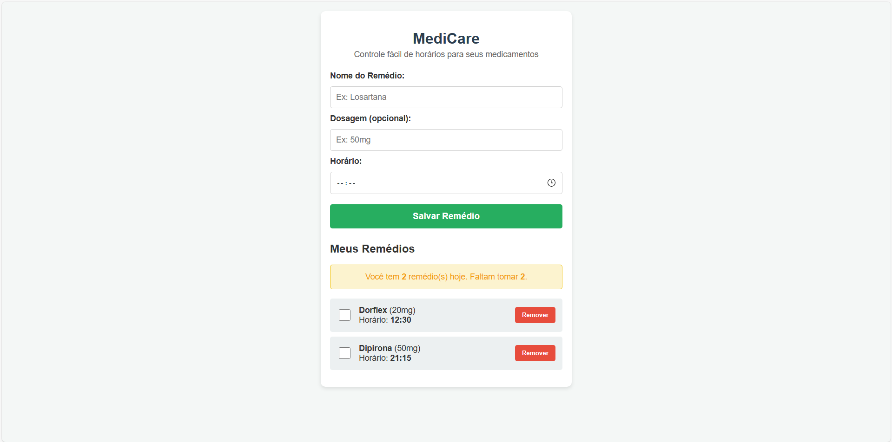

#  MediCare - Controle de Medicamentos

##  O Problema (A Dor Real)
Idosos e os seus cuidadores frequentemente lidam com rotinas complexas de medicação. Esquecer um remédio, tomar a dose errada ou confundir os horários são problemas comuns que podem gerar riscos graves à saúde. A falta de um registo simples e acessível torna esta gestão diária stressante e propensa a erros humanos.

##  A Solução Proposta
Uma aplicação web com interface simples, botões grandes e alto contraste, onde o utilizador pode registar o nome do medicamento, a dosagem e o horário. O sistema organiza estas informações automaticamente por ordem cronológica, apresenta um painel de estado e permite marcar os medicamentos como "tomados", garantindo que a rotina de saúde seja seguida corretamente.

##  Evidência de Funcionamento


## Tecnologias Utilizadas
- **Frontend:** HTML, CSS, JS
- **Armazenamento:** LocalStorage (Browser)
- **Testes Automatizados:** Jest
- **Qualidade de Código (Linting):** ESLint
- **CI/CD:** GitHub Actions

## Como Instalar e Executar o Projeto

Como o projeto utiliza tecnologias web nativas, a execução da interface não requer a instalação de servidores complexos.

1. Clone este repositório para a sua máquina:
   ```bash
   git clone [https://github.com/SEU-USUARIO/controle-medicamentos.git](https://github.com/SEU-USUARIO/controle-medicamentos.git)